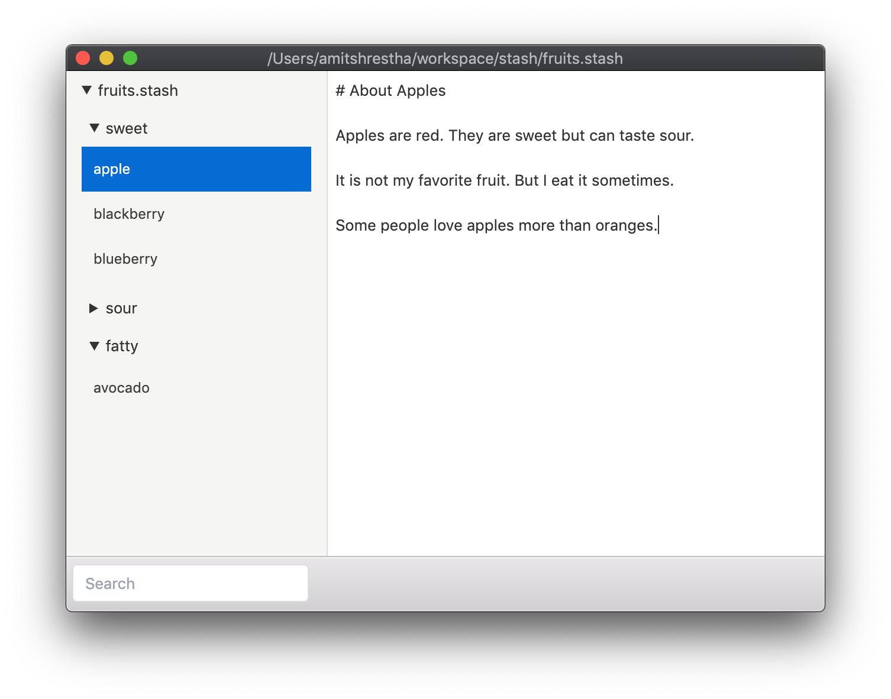

# stash-gui

`stash-gui` is a graphical interface to [stash](https://github.com/rorokimdim/stash).

</img>

## Credits

1. [stash](https://github.com/rorokimdim/stash)
2. [clojurescript](https://clojurescript.org/)
3. [electron](https://www.electronjs.org/)
4. [shadow-cljs](https://github.com/thheller/shadow-cljs)
5. [reagent](https://reagent-project.github.io/)
6. [re-frame](https://github.com/day8/re-frame)
7. All of these [libraries](https://github.com/rorokimdim/stash-gui/blob/master/package.json#L15) and all the things they depend on
8. All of these [libraries](https://github.com/rorokimdim/stash-gui/blob/master/shadow-cljs.edn#L4) and all the things they depend on
9. Every stash file is a [sqlite](https://sqlite.org/) file
